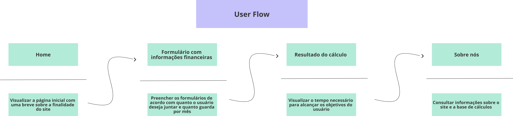

# Projeto de Interface

O site terá interface simples e instrutiva, começando por uma página introdutória contida na aba “Home”. A página também contará com um formulário, onde permitirá que o usuário informe a quantia que deseja juntar, e quanto por mês está disposto a investir ou poupar.
Com as informações do usuário obtidas, será exibido duas tabelas, informando, de acordo com o objetivo indicado, o tempo necessário para atingir o resultado desejado, separando uma tabela para o caso de poupar dinheiro, e a outra tabela para o caso de investir o dinheiro com o retorno de 1% ao mês.
O site obterá também, uma aba “Sobre Nós”, com o objetivo de informar os objetivos do projeto, a fórmula matemática utilizada para os cálculos e as linguagens utilizadas para a construção do mesmo, com o objetivo de manter a transparência com o usuário.

## User Flow

