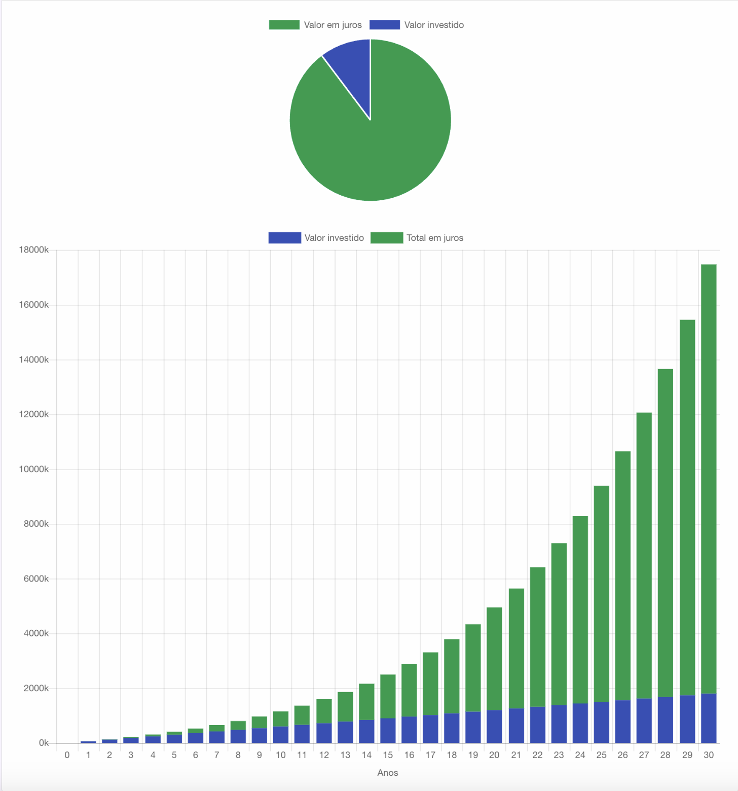

## Sobre o projeto

Nosso projeto consiste em uma calculadora que mostra a diferença entre poupar e investir dinheiro a longo prazo. Nosso objetivo é conscientizar as pessoas sobre sua situação financeira e incentivar a tomada de decisões financeiras responsáveis. Esperamos que esta calculadora ajude as pessoas a entenderem como seus hábitos de economia afetam seus resultados financeiros.

## Sobre o cálculo

Para calcular a diferença entre poupar e investir dinheiro, usamos a seguinte fórmula:

  
   
  

Onde:

`P` = Principal
`i` = Taxa de juros nominal anual em termos percentuais
`n` = Número de períodos compostos

A taxa de juros é de 1% ao mês, o que equivale a 12% ao ano. Ela é composta todos os meses, e todo mês você adiciona `R$5000`. No primeiro mês, você terá `R$5000`, mas após 30 anos, o valor se torna `R$17.474.820,66`.

Com esta calculadora, você pode ajustar o valor inicial e o período de tempo para ver como isso afeta seus resultados financeiros. Experimente diferentes cenários para ver qual é a melhor opção para você.

## Tech Stack

    - Marcação e estilos — **HTML | CSS**
    - Linguagem de Programação — **JavaScript**
    - Boilerplate — **11ty**
    - Infraestrutura/Deploy — **Surge**

## Sobre nós

Esperamos que você encontre esta calculadora útil e que ela ajude a melhorar sua compreensão sobre finanças pessoais. Se tiver alguma dúvida ou sugestão, não hesite em entrar em contato conosco. 🙂

Gabriel V. Santana
Ana
Bryan
Johnson
Joe Doe
Fulano
Ciclano